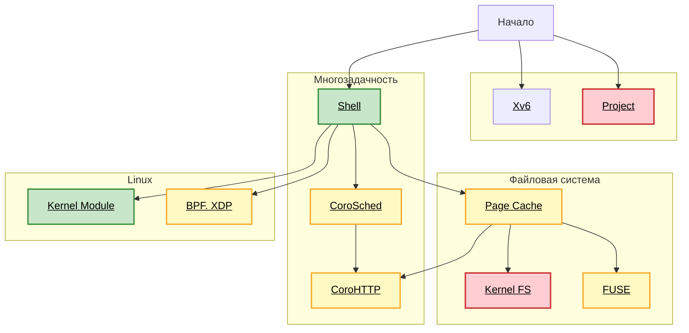

# OS Course

Добро пожаловать на курс ОС! Этот репозиторий является точкой входа. Он содержит задания ЛР, а также документацию по настройке окружения, процессу сдачи ЛР и прочему.

Если вы защищаете ЛР, то автоматически считается, что вы приняли [норму поведения](./CODE_OF_CONDUCT.md).

## Лабораторные работы

Курс наполнен различными по сложности и направленности заданиями. Сложность задания влияет на количество баллов в качестве вознаграждения. Между заданиями определен рекомендуемый порядок выполнения. Обратите внимание на [порядок сдачи ЛР](./doc/process.md).

Часть заданий выполняется в [отдельном репозитории с учебной ОС Xv6](https://github.com/secs-dev/xv6-riscv).

## Карта

Легенда:

- Цвет означает количество баллов и сложность. Серый -- тривиально (0 баллов). По возрастанию сложности: серый, зеленый, желтый, красный.

- Стрелки показывают зависимости между этапами. Вы можете выполнять их в любом порядке, но мы рекомендуем именно этот.

- По ссылке на прямоугольнике можно перейти к формулировке этапа.

