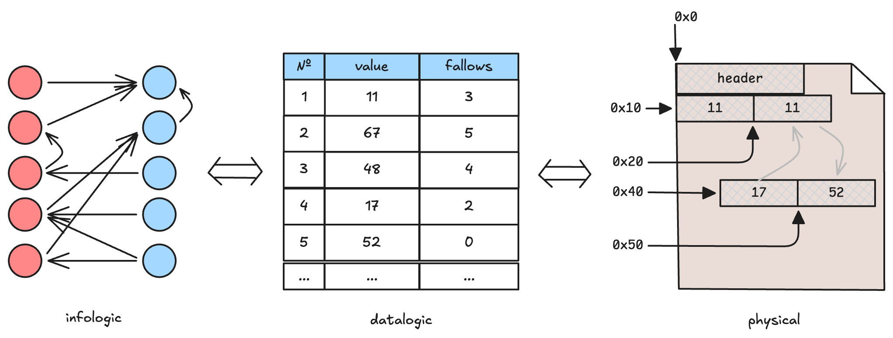

# Introductory Experiment: Экспериментальное введение в курс «Операционные системы»

> [!TIP]
> Общие методические материалы:
> - [`doc/experiments/environment.md`](../../doc/experiments/environment.md) — настройка и изоляция окружения
> - [`doc/experiments/monitoring.md`](../../doc/experiments/monitoring.md) — утилиты мониторинга и как читать их вывод
> - [`doc/experiments/statistics.md`](../../doc/experiments/statistics.md) — доверительные интервалы, выбор числа измерений N


Современные операционные системы предоставляют 2 принципиальных способа доступа к файлу:

1. через обычные функции `read()`/`write()` и перемещения к позиции в файле `lseek()`,
2. и через отображение файла в память с помощью функции `mmap()`.

Понимание возможностей и ограничений таких подходов важно при разработке приложений работающих с данными.

В рамках задания принимаем модель данных, где записи представлены в виде вершин
графа, а доступ к ним осуществляется через обходом связей между вершинами.
Вершины имеют фиксированное полжение в файле и могут быть ближе/дальше от своих
соседей.



Как именно хранятся данные, сколько занимают места нас не очень интересует,
важно то, что данные могут распологаться в близких/удалённых участках файла, а
соответственно и жесткого диска.

## 0. Цель работы

Экспериментально сравнить время работы выданных прототипов приложений, моделирующих отдельные
сценарии нагрузки, характерные при работе с данными: **чтение/обновление**
записей на диске в **последовательном/случайном** порядке.

А также научится ставить эксперимент (над ОС) корректно: фиксировать окружение,
выбирать инструменты, планировать число измерений и обрабатывать результат
статистически — а не делать вывод по 1–3 запускам «на глаз». Эти базовые
принципы помогут при проведении исследований в профессинальной деятельности или, например, во время выполнения ВКР.

## 1. Предмет исследования

Итоговая метрика в каждого эксперимента — одно число, **оценка времeни**
обхода вершин графа.

Приложения участвующие в эксперименте лежат в репозитории по следующим путям:

- `lab/util/graphgen.py` — параметризованный генератор графа: создаёт бинарный
  файл с сериализованной в него структурой данных.
- `lab/intro-exp/src/graph_traverse.c` — обходит граф с помощью
  `read()`/`lseek()`.
- `lab/intro-exp/src/graph_traverse_mmap.c` — та же логика обхода, но с помощью
  `mmap()`.

Оба приложения имеют набор опций командной строки:

```sh
<app> [--write] [--no-cache] <iterations> <file1> [file2 ...]
```

- `--write` — обход в режиме записи (меняет данные в посещаемых вершинах);
- `--no-cache` — отключет системное кеширование (c нюансом для `mmap()`)
- `<iterations>` — число повторений обходов (чтобы увеличить время работы);
- `[file2 ...]` – дополнительные файлы для обхода (чтобы увеличить время работы,
  но по-другому).

> [!NOTE]
> Детали реализации `--no-cache` не так важны, но если интересно, их можно
  почерпнуть в комментариях к [`src/graph_io.h`](src/graph_io.h) и
  [`src/graph_traverse_mmap.c`](src/graph_traverse_mmap.c).

## 2. Подготовка тестовых данных

Соберите два графа одинакового размера и с одинаковым `seed` (чтобы отличался
именно паттерн доступа, а не «сложность» данных), но с разной топологией:

```sh
# "случайная" топология — узлы расположены в файле почти без пространственной локальности
python3 graphgen.py -s 64M --seed 427 -o graph-rand.bin

# "цепочечная" топология — с ограничением минимального шага между узлами,
# чтобы не получить тривиальные попадания в одну и ту же страницу памяти
python3 graphgen.py -s 64M --seed 427 --topology chain -b 0.7 \
  --min-step-pages 2 -o graph-seq.bin
```

Пояснение параметров (детали — `graphgen.py --help`):

- `-s` — приблизительный размер файла графа;
- `--seed` — сид генератора псевдослучайных чисел (для воспроизводимости);
- `--topology` — тип структуры графа; топология по умолчанию даёт разбросанные
  по файлу переходы, `chain` — управляемо-локальные;
- `-b/--branching` — фактор ветвления для `chain`-топологии (доля переходов,
  идущих «по цепочке», а не в сторону);
- `--min-step-pages` — минимальное расстояние (в страницах памяти) между
  последовательно посещаемыми узлами; не даёт `chain`-топологии выродиться в
  обращения внутри одной и той же страницы, что сделало бы сравнение с
  `read()`/`mmap()` неинтересным на уровне page fault/page cache.

**Опциональное расширение**: варьируя `-b`/`--min-step-pages`, можно
получить непрерывный спектр паттернов доступа между «полностью случайным» и
«полностью последовательным» — это выходит за рамки базового варианта
задания (см. раздел 0 — там зафиксированы всего 2 конфигурации), но может
быть предложено как углублённый вариант по согласованию с преподавателем.

## 3. Сборка приложений

```sh
mkdir -p out
clang -o out/graph_traverse src/graph_traverse.c -Wall -O2
clang -o out/graph_traverse_mmap src/graph_traverse_mmap.c -Wall -O2
```

Обе программы рассчитаны на Linux, macOS и FreeBSD
(если `clang` недоступен, `gcc` собирает те же исходники с теми же флагами).
Примеры инструментов измерения ниже ориентированы на Linux; на других ОС
нужны соответствующие аналоги.

Регрессионный тест (из корня репозитория):

```sh
python3 lab/intro-exp/tests/test_no_cache.py
```

Тест проверяет обход и содержимое файлов, но не фактическое отсутствие кэширования.

## 4. Этап 1: исследование `graph_traverse` (read/lseek)

### Шаг 4.1. Снять паспорт системы

Нужно собрать максимум важной для эксперимента информации о системе. Если
информацию получить не удалось, укажите причину в отчёте, но не подменяйте
неизвестные параметры догадками.

См. [`doc/experiments/monitoring.md`](../../doc/experiments/monitoring.md),
раздел «Паспорт системы»: `uname -a`, `lscpu`, `lscpu -e`, `free -h`,
`lshw`/`smartctl` для диска, `nproc`.

> [!NOTE]
> Если работа выполняется в виртуальной машине, неполный или обобщённый вывод
> части команд в гостевой ОС — ожидаемое поведение. [Подумайте почему
> какие-то параметры доступны, а какие-то нет]
>
> Недостающие сведения постарайтесь определить как-то иначе,
> например, из хостовой системы. Но не забывайте указывать источник полученной
> информации. И не выдавайте характеристики виртуального устройства за
> характеристики физического хоста. 

Собранная информация будет служить основанием для дальнейших выводов по работе и
ни в коем случае не должна замалчиваться.

### Шаг 4.2. Подготовить окружение

Пройдите чек-лист из
[`doc/experiments/environment.md`](../../doc/experiments/environment.md):
закрыть фон, зафиксировать governor CPU, закрепить процесс на ядре
(`taskset`), выбрать методологию состояния кэша.

Для этого задания методология кэша управляется в первую очередь флагом
`--no-cache` самих программ (см. раздел 1) — при необходимости комбинируйте
его с ручным `drop_caches`, но не смешивайте режимы внутри одной серии.

### Шаг 4.3. Ознакомительные (baseline) измерения

Запустите приложение по разу на каждом графе и посмотрите, как это выглядит:

```sh
time ./out/graph_traverse 1 graph-rand.bin
time ./out/graph_traverse 1 graph-seq.bin
```

Обратите внимание на соотношение `usr`/`sys` времени — это и есть метрика
User/Kernel Time из паспорта эксперимента; для `--write`-режима больших
`sys time` стоит ожидать больше, чем для чтения, из-за обратной записи
изменённых страниц. Определите разницу поведения приложения в разных режимах c
помощью `strace` [возможно у утилиты есть полезные опции].

Для более детальной картины используйте `/usr/bin/time -v` и `perf stat`
(события `context-switches`, `cpu-migrations`, `page-faults`,
`cache-misses`) — см.
[`doc/experiments/monitoring.md`](../../doc/experiments/monitoring.md).

Повторите один из запусков с фоновой нагрузкой (`stress-ng`), чтобы увидеть,
как выглядит «шумное» измерение — методика та же, что в общей методичке.

### Шаг 4.4. Сформулировать гипотезу

Запишите явно, что вы ожидаете и почему, например:

- на HDD разница должна быть выражена сильнее, чем на SSD/NVMe, из-за
  времени позиционирования головки;
- файл меньшего размера обходится быстрее при любой конфигурации запуска.

Здесь стоит подумать, что на ваш взгляд является важным с точки зрения работы
операционной системы и выбрать конфигурации запусков, которые вы будете
сравнивать. Либо использовать условие из вашего варианта задания, выданного
практиком.

### Шаг 4.5. Спланировать эксперимент

Зафиксируйте письменно (пойдёт в отчёт):

1. Метрика на запуск — wall time обхода (из `time`/`/usr/bin/time -v`), при
   фиксированном числе `<iterations>` и одинаковом наборе файлов на всех
   запусках конфигурации.
2. Методология состояния кэша (раздел 4.2) — одна и та же для всей серии
   одной конфигурации.
3. Число повторов N и порядок запуска — интерливинг `graph-seq`/`graph-rand`,
   а не блоками (защита от систематического дрейфа: нагрев CPU, фоновые
   cron-задачи и т.д.).
4. Прогревочные запуски — сколько первых отбрасывается и почему (решение
   принимается до просмотра результатов).
5. Разделение измерения и мониторинга — финальную серию замеряйте
   минимально инвазивным способом (`time`/`/usr/bin/time`, не `perf
   stat`/`strace` на каждый запуск).

Как обосновать N и что такое доверительный интервал в этом контексте —
[`doc/experiments/statistics.md`](../../doc/experiments/statistics.md).

### Шаг 4.6. Зафиксировать окружение перед серией

Повторите шаг 4.1 непосредственно перед стартом финальной серии («снимок
до»): `uptime`, `top -bn1`, при наличии доступа — температура/троттлинг.

### Шаг 4.7. Провести серию измерений

Пример каркаса скрипта сбора:

```bash
#!/usr/bin/env bash
set -euo pipefail

CORE=2
N=30
ITER=5
OUT=results_read.csv
echo "timestamp,graph,run_id,wall_time_s,user_time_s,sys_time_s,vol_ctx,invol_ctx,minflt,majflt" > "$OUT"

graphs=(graph-seq.bin graph-rand.bin)
for i in $(seq 1 $N); do
  for g in "${graphs[@]}"; do
    ts=$(date +%s)
    /usr/bin/time -v taskset -c $CORE ./out/graph_traverse --no-cache "$ITER" "$g" \
      2> /tmp/time_out.$$ 1> /tmp/prog_out.$$

    wall=$(grep "Elapsed (wall clock)" /tmp/time_out.$$ | awk -F': ' '{print $2}')
    user=$(grep "User time"   /tmp/time_out.$$ | awk '{print $4}')
    sys=$(grep  "System time" /tmp/time_out.$$ | awk '{print $4}')
    volc=$(grep "voluntary context switches" /tmp/time_out.$$ | head -1 | awk '{print $1}')
    invc=$(grep "involuntary context switches" /tmp/time_out.$$ | awk '{print $1}')
    minf=$(grep "Minor (reclaiming a frame) page faults" /tmp/time_out.$$ | awk '{print $NF}')
    majf=$(grep "Major (requiring I/O) page faults" /tmp/time_out.$$ | awk '{print $NF}')

    echo "$ts,$g,$i,$wall,$user,$sys,$volc,$invc,$minf,$majf" >> "$OUT"
    rm -f /tmp/time_out.$$ /tmp/prog_out.$$
  done
done
```

Требования к скрипту сбора: сохраняет сырые данные каждого запуска[^enough-data] (не
только среднее); сохраняет достаточно метаданных для воспроизведения
(имя графа, `--no-cache`/`--write`, число итераций, `taskset`); входит
целиком в сдаваемые материалы и воспроизводимо запускается на защите.

[^enough-data]: В разумных пределах, конечно же, не нужно хранить десятки-сотни гигабайт логов.

### Шаг 4.8. Проанализировать измерения

Для `graph-seq.bin` и `graph-rand.bin` посчитайте среднее, стандартное
отклонение и доверительный интервал (методика —
[`doc/experiments/statistics.md`](../../doc/experiments/statistics.md)).
Явно опишите, что сделано с выбросами/прогревом. Постройте столбчатую
диаграмму средних с усами ДИ — поскольку измерение точечное (не
зависимость от параметра), развёрнутый график не нужен.

Для большей иллюстративности можно попросить вашего Джарвиса построить график
распределения. Это может быть наивная гистограмма или более качественный её
аналог — KDE. Так вы явно увидите различия измерений.

### Шаг 4.9. Сформулировать вывод

Ответьте явно:

1. **Сравнение**: что больше/меньше и насколько? Согласуется ли с гипотезой
   шага 4.4? Если нет — какой механизм ОС/железа это объясняет?
2. **Погрешность**: устраивает ли вас ширина ДИ? Пересекаются ли интервалы
   `graph-seq` и `graph-rand`?
3. **Достаточность**: помогут ли делу ещё N измерений? Оцените (хотя бы
   грубо) по формуле из общей методички.

## 5. Этап 2: исследование `graph_traverse_mmap`

Повторите шаги 4.1–4.9 для `graph_traverse_mmap`, самостоятельно написав
скрипты сбора по аналогии с Этапом 1:

```sh
./out/graph_traverse_mmap --no-cache 5 graph-seq.bin
./out/graph_traverse_mmap --no-cache 5 graph-rand.bin
```

Отличия, на которые стоит обратить внимание:

- сравните количество contex-switch и page faults для `read()`/`lseek()` и
  `mmap()` и объясните наблюдение и учтите в замерах;

- ожидайте, что выводы **изменятся** по сравнению с Этапом 1 — в этом и
  ценность повторного исследования. Не подгоняйте методологию под то, чтобы
  получить «те же» выводы.

## 6. Этап 3: итоговое сравнение и общий вывод

Сведите все четыре серии (`graph_traverse`×`graph-seq`,
`graph_traverse`×`graph-rand`, `graph_traverse_mmap`×`graph-seq`,
`graph_traverse_mmap`×`graph-rand`) в одну таблицу и одну диаграмму/график. Дайте
общий вывод по работе:

- Какие условия измерения оказались критичными, а чем можно было
  пренебречь? (например: `taskset` оказался важен, а конкретная модель
  диска — не так важна, если граф поместился в кэш и т.п. — используйте
  свои реальные наблюдения);
- Насколько интрузивны были сами инструменты измерения? Отличалось ли время
  обхода под `perf stat`/`strace` от времени под «голым» `time`/
  `/usr/bin/time`? См. раздел 8 в
  [`doc/experiments/statistics.md`](../../doc/experiments/statistics.md).

## 7. Что сдаётся

1. Скрипт генерации графов с использованными опциями и
   скрипты сбора измерений (Этап 1 и Этап 2) — должны воспроизводимо
   запускаться.
2. Сырые данные (CSV или аналогичный формат) по всем 4 сериям.
3. Скрипт/ноутбук обработки (среднее, ДИ, график).
4. Отчёт, включающий: паспорт системы, описание настройки окружения,
   гипотезы, обоснование N и методологии кэша, таблицу и график сравнения
   4 серий, ответы на вопросы Этапа 3.

## 8. Требования к защите

Будьте готовы по требованию:

- показать и заново прогнать скрипты сбора измерений (включая генерацию
  графов через `graphgen.py`) на любой доступной машине;
- объяснить каждое решение по настройке окружения;
- объяснить, как посчитан доверительный интервал, и что произойдёт с
  выводом, если N увеличить/уменьшить;
- обосновать выбор размера графа (`-s`) относительно объёма RAM и выбранной
  методологии кэша.

## 9. Дополнительные материалы

- Видео-гайд по постановке экспериментов: <https://youtu.be/0VKhPE1lWos>
- [`doc/experiments/environment.md`](../../doc/experiments/environment.md)
- [`doc/experiments/monitoring.md`](../../doc/experiments/monitoring.md)
- [`doc/experiments/statistics.md`](../../doc/experiments/statistics.md)
- `man taskset`, `man nice`, `man renice`, `man perf-stat`, `man vmstat`,
  `man mpstat`, `man pidstat`, `man iostat`, `man stress-ng`, `man mmap`,
  `man 2 madvise` и тд.
